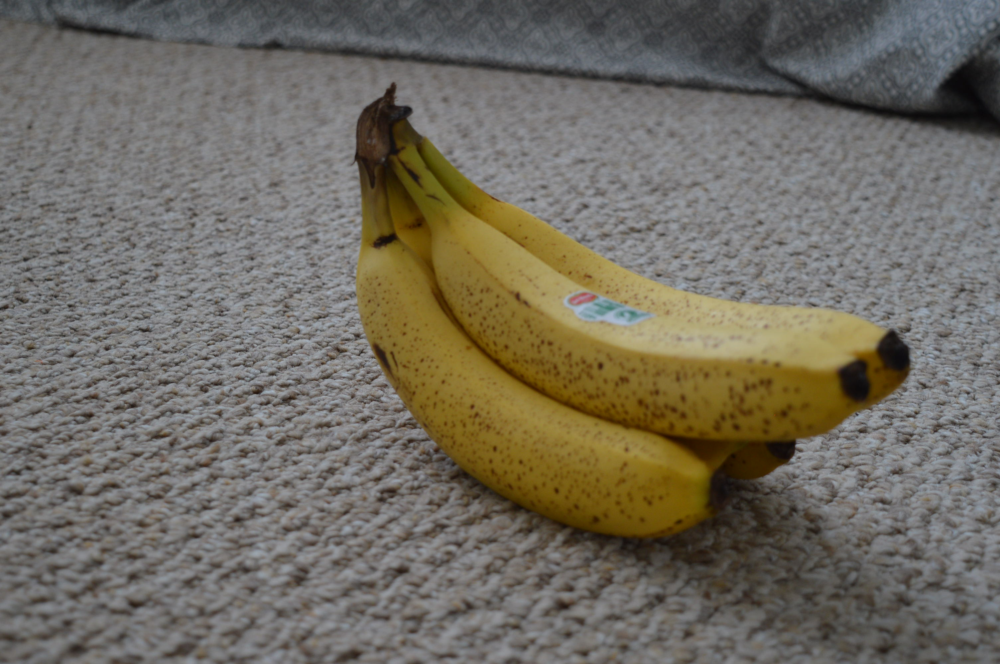

## 3D Model Creation
The 3D model created for this lab was made using JPG images of a bunch of bananas from various angles. There were 16 photos in total. 

The photos were then uploaded to Agisoft Metashape Professional and "aligned" using AgiSoft's Align Photos option. At this stage, Metashape searches for common points on the banana photographs and matches them. It also finds the position of the camera for each picture and refines camera calibration parameters. As a result a sparse point cloud and a set of camera positions are formed.

