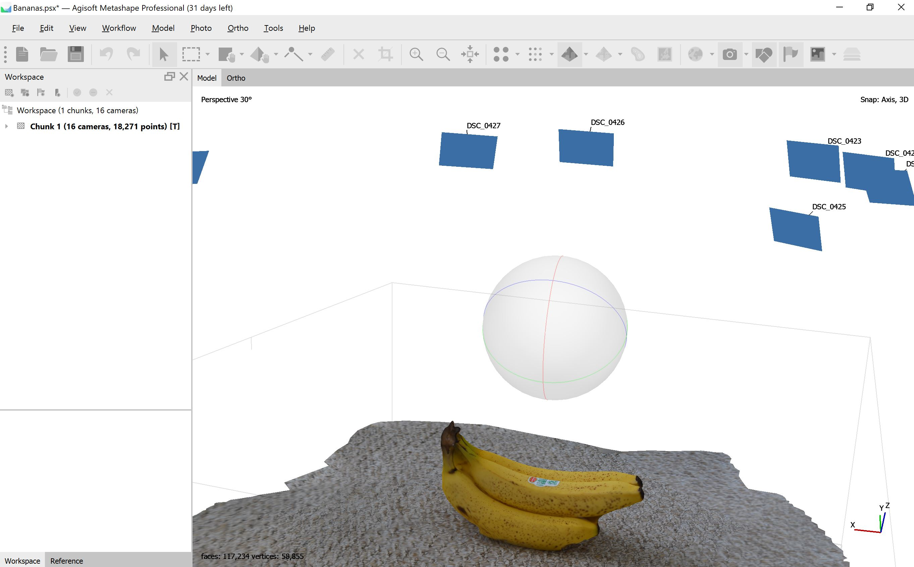

## 3D Model Creation
The 3D model created for this lab was made using JPG images of a bunch of bananas from various angles. There were 16 photos in total. 

The photos were then uploaded to Agisoft Metashape Professional and "aligned" using AgiSoft's Align Photos option. At this stage, Metashape searches for common points on the banana photographs and matches them. It also finds the position of the camera for each picture and refines camera calibration parameters. As a result a sparse point cloud and a set of camera positions are formed.

The next stage is generating the dense point cloud that is built by Metashape based on the estimated camera
positions and pictures themselves. The dense point cloud may be edited and classified prior to export or
proceeding to the next stage.

The third stage is generation of a surface; in this case, mesh. 3D polygonal mesh model represents
the object surface based on the dense or sparse point cloud. 

Finally, the surface can be textured, and the model is done and ready to be exported. 

